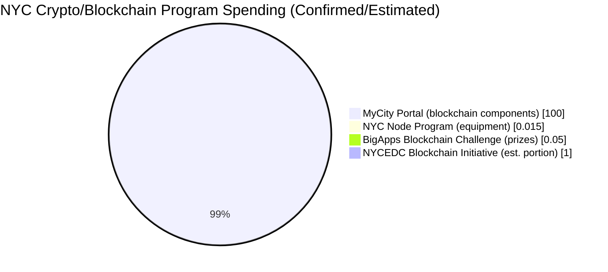
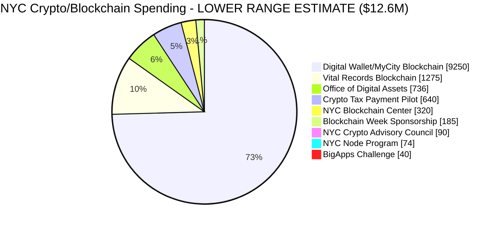
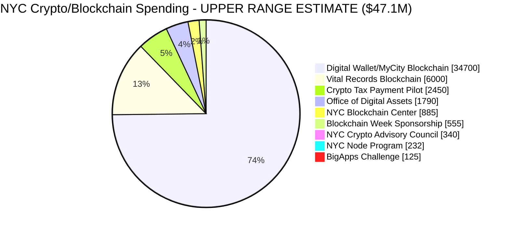

# New York City Public Cryptocurrency and Blockchain Programs: Comprehensive Report

## Executive Summary

New York City has emerged as a significant player in the cryptocurrency and blockchain space, particularly under Mayor Eric Adams' administration (2022-2025). This report catalogs all public programs, initiatives, offices, and partnerships related to cryptocurrency and blockchain technology in NYC, including governance structures, budgets, key personnel, and critical analysis.

---

## Table of Contents

1. [Overview of NYC Crypto Landscape](#overview-of-nyc-crypto-landscape)
2. [Programs and Initiatives Summary Table](#programs-and-initiatives-summary-table)
3. [Detailed Program Descriptions](#detailed-program-descriptions)
4. [Key Personnel and Governance](#key-personnel-and-governance)
5. [Private Sector Partners and Advisors](#private-sector-partners-and-advisors)
6. [Regulatory Environment](#regulatory-environment)
7. [Political Opposition and Critique](#political-opposition-and-critique)
8. [Sources](#sources)

---

## Overview of NYC Crypto Landscape

New York City's approach to cryptocurrency has been shaped by two competing forces:

1. **Pro-Crypto Executive Branch**: Mayor Eric Adams has been an outspoken cryptocurrency advocate, famously converting his first three paychecks into Bitcoin and Ether in 2022, and establishing the nation's first municipal Office of Digital Assets and Blockchain.

2. **Strict State Regulatory Environment**: New York State's BitLicense, implemented in 2015 by the Department of Financial Services (DFS), remains the most demanding operating permit for crypto businesses in the United States, leading to what critics call the "Great Bitcoin Exodus" when at least ten companies left the state.

---

## Programs and Initiatives Summary Table

| Program/Initiative | Lead Agency | Budget/Funding (with source) | Status | Key Personnel | Launch Date |
|-------------------|-------------|------------------------------|--------|---------------|-------------|
| [Office of Digital Assets and Blockchain](https://www.nyc.gov/mayors-office/news/2025/10/executive-order-57) | Mayor's Office / OTI | Part of OTI's [$775.2M budget](https://council.nyc.gov/budget/wp-content/uploads/sites/54/2024/05/OTI.pdf) (specific allocation undisclosed) | Active | Moises Rendon (Executive Director) | October 2025 |
| [NYC Crypto Advisory Council](https://www.coindesk.com/policy/2025/05/20/nyc-mayor-eric-adams-creating-crypto-advisory-council) | Mayor's Office | Undisclosed (volunteer advisors) | Active | June Ou (Figure), Richie Hecker (Traction & Scale) | May 2025 |
| [NYC Blockchain Center](https://edc.nyc/press-release/nycedc-open-nyc-s-public-private-blockchain-center) | NYCEDC | Part of NYCEDC's [$36.7M budget](https://council.nyc.gov/budget/wp-content/uploads/sites/54/2024/03/EDC-1.pdf) + private funding (PPP) | Active (since 2019) | GBBC, Future Perfect Ventures | January 2019 |
| [NYC Node Program](https://edc.nyc/press-release/nycedc-nyc-talent-and-cuny-queens-college-launch-nyc-node-blockchain-applied-learning) | NYCEDC / NYC Talent / CUNY | ~$10,000-$15,000 (estimated equipment: CPU, motherboard, GPU) | Active | Joshua Gottlieb (Founder) | April 2024 |
| [NYC BigApps Blockchain Challenge](https://edc.nyc/press-release/nycedc-announces-winners-annual-nyc-bigapps-blockchain-competition) | NYCEDC | ~$50,000 (estimated cash + in-kind prizes) | Completed (2019) | N/A | 2019 |
| [Blockchain Week NYC](https://edc.nyc/press-release/nycedc-and-coindesk-announce-second-annual-blockchain-week-nyc-returning-may-10-17) | NYCEDC / CoinDesk | [$28.5M economic impact](https://edc.nyc/press-release/nycedc-and-coindesk-announce-second-annual-blockchain-week-nyc-returning-may-10-17) (2018); city sponsorship undisclosed | Annual Event | CoinDesk | May 2018 |
| [MyCity Portal (Blockchain Integration)](https://www.nyc.gov/office-of-the-mayor/news/217-23/mayor-adams-launches-first-phase-mycity-portal-easily-help-new-yorkers-check-eligibility-) | OTI | **[$100M+](https://nysfocus.com/2025/03/19/mycity-eric-adams-child-care)** (total portal; ~$73M to contractors) | In Development | Matthew Fraser (CTO) | 2023 |
| [Digital Wallet Initiative](https://www.gothamgazette.com/city/11883-city-council-mayor-adams-blockchain-cryptocurrency) | OTI | Included in MyCity budget | Proposed | Matthew Fraser (CTO) | Announced 2022 |
| [BitBonds Proposal](https://www.coindesk.com/policy/2025/05/28/nyc-mayor-eric-adams-calls-for-the-end-of-nydfs-bitlicense-proposes-bitbond) | Mayor's Office | $0 ([Rejected](https://comptroller.nyc.gov/newsroom/comptroller-brad-lander-pours-cold-water-on-mayor-adams-bitbonds-proposal/)) | Rejected by Comptroller | Eric Adams | May 2025 |
| [Vital Records on Blockchain](https://www.dlnews.com/articles/regulation/nyc-mayor-says-city-exploring-crypto-for-taxes-and-records/) | OTI | Undisclosed (exploratory) | Exploratory | Matthew Fraser (CTO) | 2025 |
| [Crypto Tax/Fee Payment Pilot](https://statescoop.com/nyc-digital-assets-blockchain-office/) | OTI / Office of Digital Assets | Undisclosed (exploratory) | Exploratory | Moises Rendon | 2025 |

---

## Budget Visualization

### Total Confirmed Public Spending on Crypto/Blockchain Programs

Based on publicly available budget information, the following represents confirmed or estimated public expenditures:

### Budget Summary Table

| Category | Amount | Source | Notes |
|----------|--------|--------|-------|
| **MyCity Portal** | $100,000,000+ | [New York Focus](https://nysfocus.com/2025/03/19/mycity-eric-adams-child-care) | Total portal development; blockchain/digital wallet components are subset |
| **MyCity Contractor Payments** | $73,000,000+ | [New York Focus](https://nysfocus.com/2025/03/19/mycity-eric-adams-child-care) | Delivery orders to 8 companies |
| **OTI Total FY2025 Budget** | $775,200,000 | [NYC Council Budget](https://council.nyc.gov/budget/wp-content/uploads/sites/54/2024/05/OTI.pdf) | Digital Assets Office operates within this |
| **NYCEDC FY2025 Budget** | $36,700,000 | [NYC Council Budget](https://council.nyc.gov/budget/wp-content/uploads/sites/54/2024/03/EDC-1.pdf) | Blockchain Center, Node Program within this |
| **NYC Node Program** | ~$15,000 | [NYCEDC](https://edc.nyc/press-release/nycedc-nyc-talent-and-cuny-queens-college-launch-nyc-node-blockchain-applied-learning) | Ethereum node equipment (estimated) |
| **BigApps Blockchain Challenge** | ~$50,000 | [NYCEDC](https://edc.nyc/press-release/nycedc-announces-winners-annual-nyc-bigapps-blockchain-competition) | Cash and in-kind prizes (estimated) |
| **Blockchain Week NYC** | $28,500,000 | [NYCEDC](https://edc.nyc/press-release/nycedc-and-coindesk-announce-second-annual-blockchain-week-nyc-returning-may-10-17) | Economic impact (2018); not direct city spending |

### Key Budget Findings

1. **MyCity Portal dominates spending**: The $100M+ MyCity portal represents the vast majority of confirmed public spending on blockchain-adjacent initiatives. However, it's important to note that blockchain integration is only one component of a broader digital services portal.

2. **Most crypto-specific budgets are undisclosed**: The Office of Digital Assets and Blockchain, Crypto Advisory Council, and most NYCEDC blockchain activities do not have publicly disclosed specific budget allocations.

3. **Economic impact ≠ public spending**: The $28.5M figure for Blockchain Week NYC represents economic impact to the city (hotel stays, meals, tax revenue), not direct public expenditure on the event.

4. **OTI operates with ~$775M annually**: The Office of Technology and Innovation's total budget provides context for blockchain initiatives, though the specific allocation to crypto/blockchain programs is not itemized publicly.

5. **Transparency gaps**: Multiple programs lack disclosed budgets, consistent with [New York Focus reporting](https://nysfocus.com/2025/03/19/mycity-eric-adams-child-care) on lack of oversight and public bidding processes

---

## Undisclosed Budget Estimation Analysis

The following analysis provides estimated budget ranges for programs with undisclosed spending, based on detailed evaluation of technological requirements, project scope, comparable municipal initiatives, and NYC government salary/contracting norms.

### Methodology

Budget estimates are derived from:
- **Personnel costs**: NYC government salary bands + 45% fringe benefits loading
- **Technology costs**: Enterprise blockchain implementation benchmarks, cloud infrastructure pricing
- **Comparable programs**: Similar initiatives in other jurisdictions (Estonia digital ID, Colorado crypto payments, etc.)
- **Real estate**: Chelsea commercial rates (~$60-80/sqft for Class A office)
- **Consulting rates**: NYC government IT consulting contracts ($150-400/hour for specialized blockchain expertise)

---

### Program-by-Program Scope Analysis and Budget Estimates

#### 1. Office of Digital Assets and Blockchain

| Factor | Assessment |
|--------|------------|
| **Technological Scope** | LOW - Primarily policy coordination, not technology development |
| **Staffing Requirements** | Executive Director (1), Policy Analysts (2-4), Admin Support (1) |
| **Operational Needs** | Office within OTI, inter-agency coordination, industry outreach, commission formation |
| **Comparable** | NYC Mayor's Office of Media and Entertainment (~$4M budget, 25 staff) |

**Cost Breakdown Estimate**:
| Component | Lower Range | Upper Range |
|-----------|-------------|-------------|
| Executive Director (1 FTE @ $180K + 45% benefits) | $261,000 | $261,000 |
| Policy Analysts (2-4 FTE @ $95-130K + benefits) | $275,000 | $754,000 |
| Administrative Support (0.5-1 FTE) | $50,000 | $100,000 |
| Consultants/Subject Matter Experts | $75,000 | $400,000 |
| Events, Outreach, Communications | $50,000 | $200,000 |
| Office Operations (within OTI) | $25,000 | $75,000 |
| **Annual Total** | **$736,000** | **$1,790,000** |

---

#### 2. NYC Crypto Advisory Council

| Factor | Assessment |
|--------|------------|
| **Technological Scope** | NONE - Purely advisory, no technology development |
| **Staffing Requirements** | Coordination by existing OTI/Mayor's Office staff |
| **Operational Needs** | Summit events (Gracie Mansion), ongoing meetings, materials |
| **Comparable** | NYC Small Business Advisory Commission (~$150K annual operating) |

**Cost Breakdown Estimate**:
| Component | Lower Range | Upper Range |
|-----------|-------------|-------------|
| Summit Event Production (Gracie Mansion, 150+ attendees) | $35,000 | $125,000 |
| Staff Coordination Time (0.25-0.5 FTE equivalent) | $30,000 | $75,000 |
| Meeting Logistics (quarterly convenings) | $15,000 | $50,000 |
| Materials, Communications, Documentation | $10,000 | $40,000 |
| Travel/Hospitality for Out-of-Town Advisors | $0 | $50,000 |
| **Annual Total** | **$90,000** | **$340,000** |

---

#### 3. NYC Blockchain Center (City Portion of Public-Private Partnership)

| Factor | Assessment |
|--------|------------|
| **Technological Scope** | LOW - Facility operations, not direct tech development |
| **Staffing Requirements** | NYCEDC liaison staff (1-2 FTE), operated by private partners |
| **Operational Needs** | Chelsea facility (~3,000-5,000 sqft), programming support |
| **Comparable** | NYCEDC-supported incubators (Urbantech NYC: ~$1.5M city contribution) |

**Cost Breakdown Estimate**:
| Component | Lower Range | Upper Range |
|-----------|-------------|-------------|
| Rent Subsidy (partial, Chelsea ~$65/sqft × 4,000 sqft × 50% subsidy) | $130,000 | $260,000 |
| NYCEDC Staff Liaison (0.5-1 FTE) | $75,000 | $175,000 |
| Programming/Event Support | $50,000 | $200,000 |
| Marketing, Promotion, Blockchain Week Coordination | $40,000 | $150,000 |
| Operational Support to Partners | $25,000 | $100,000 |
| **Annual Total (City Portion)** | **$320,000** | **$885,000** |

*Note: Private partners (GBBC, Future Perfect Ventures) contribute additional funding via membership dues and corporate partnerships.*

---

#### 4. NYC Node Program (Full Program Cost)

| Factor | Assessment |
|--------|------------|
| **Technological Scope** | MEDIUM - Ethereum node infrastructure, curriculum development |
| **Staffing Requirements** | Program coordination, CUNY faculty time, student teams |
| **Operational Needs** | Node hardware, cloud costs, workshop facilitation, 200+ students |
| **Comparable** | University blockchain lab programs ($50K-250K annually) |

**Cost Breakdown Estimate**:
| Component | Lower Range | Upper Range |
|-----------|-------------|-------------|
| Ethereum Archive Node Hardware (high-end workstation) | $8,000 | $15,000 |
| Cloud/Hosting Infrastructure (ongoing) | $3,000 | $12,000 |
| Program Coordination (NYCEDC/NYC Talent staff time) | $25,000 | $75,000 |
| CUNY Faculty/Staff Time (in-kind + direct) | $15,000 | $50,000 |
| Curriculum Development | $10,000 | $40,000 |
| Workshop Facilitation (semesterly, 200+ students) | $8,000 | $25,000 |
| Industry Partner Coordination | $5,000 | $15,000 |
| **Annual Total** | **$74,000** | **$232,000** |

---

#### 5. Blockchain Week NYC (City Sponsorship)

| Factor | Assessment |
|--------|------------|
| **Technological Scope** | NONE - Event sponsorship, not technology |
| **Staffing Requirements** | NYCEDC event coordination staff |
| **Operational Needs** | Sponsorship package, city marketing, job fair logistics |
| **Comparable** | NYCEDC major event sponsorships ($100K-500K range) |

**Cost Breakdown Estimate**:
| Component | Lower Range | Upper Range |
|-----------|-------------|-------------|
| Sponsorship Contribution to CoinDesk/Consensus | $75,000 | $250,000 |
| NYCEDC Staff Time (event coordination) | $40,000 | $100,000 |
| Blockchain Job Fair Production (free public event) | $30,000 | $80,000 |
| Marketing, City Branding, Promotional Materials | $25,000 | $75,000 |
| Venue/Logistics Support | $15,000 | $50,000 |
| **Annual Total** | **$185,000** | **$555,000** |

---

#### 6. Digital Wallet Initiative (Blockchain Portion of MyCity)

| Factor | Assessment |
|--------|------------|
| **Technological Scope** | HIGH - Core blockchain infrastructure, wallet systems, identity verification |
| **Staffing Requirements** | Significant contractor workforce (included in $73M+ contractor spend) |
| **Operational Needs** | Enterprise blockchain development, security audits, compliance, integration with 4+ city agencies |
| **Comparable** | Government digital wallet systems (India UPI: $100M+, smaller municipal: $5-20M) |

**Estimation Methodology**: The $100M+ MyCity portal includes general web development, UX/UI, API integrations, and blockchain-specific components. Based on the stated goals (digital wallet for benefits/payroll, blockchain-secured records), we estimate the blockchain-specific portion as follows:

| Component | Lower Range | Upper Range |
|-----------|-------------|-------------|
| Blockchain Architecture Design & Development | $3,000,000 | $12,000,000 |
| Digital Wallet Infrastructure | $2,000,000 | $8,000,000 |
| Identity/Authentication Systems (blockchain-based) | $1,500,000 | $5,000,000 |
| Security Audits, Penetration Testing (blockchain-specific) | $400,000 | $1,500,000 |
| Smart Contract Development/Audit | $300,000 | $1,200,000 |
| Integration with Existing City Systems | $800,000 | $3,000,000 |
| Compliance, Legal, Regulatory | $500,000 | $1,500,000 |
| Blockchain Consultants/SMEs | $750,000 | $2,500,000 |
| **Blockchain Portion of MyCity** | **$9,250,000** | **$34,700,000** |

*Note: This represents an estimated 9-35% of total MyCity spending, depending on scope of blockchain integration.*

---

#### 7. Vital Records on Blockchain

| Factor | Assessment |
|--------|------------|
| **Technological Scope** | HIGH (if implemented) - Healthcare-grade security, vital records integration |
| **Staffing Requirements** | Requires specialized blockchain/health IT consultants |
| **Operational Needs** | Integration with Dept. of Health, HIPAA-equivalent compliance, birth/death certificate systems |
| **Comparable** | Estonia X-Road/blockchain ID (~€100M over 20 years); US county pilots ($500K-5M) |

**Cost Breakdown Estimate** (Exploratory Phase through Initial Pilot):
| Component | Lower Range | Upper Range |
|-----------|-------------|-------------|
| Feasibility Study / Requirements Analysis | $150,000 | $400,000 |
| Vendor Assessment / RFP Process | $50,000 | $150,000 |
| Proof of Concept Development | $200,000 | $750,000 |
| Security Architecture Design | $100,000 | $400,000 |
| Compliance/Legal Review (HIPAA-adjacent, state law) | $75,000 | $300,000 |
| Pilot Implementation (if approved) | $500,000 | $3,000,000 |
| Integration with Dept. of Health Systems | $200,000 | $1,000,000 |
| **Total (Exploratory + Pilot)** | **$1,275,000** | **$6,000,000** |

---

#### 8. Crypto Tax/Fee Payment Pilot

| Factor | Assessment |
|--------|------------|
| **Technological Scope** | HIGH - Payment gateway integration, crypto-to-fiat conversion, compliance |
| **Staffing Requirements** | Policy staff + payment systems engineers/contractors |
| **Operational Needs** | Integration with Dept. of Finance, payment processors, anti-money laundering compliance |
| **Comparable** | Colorado crypto tax payments (minimal uptake, ~$100K implementation); Miami crypto initiatives (~$500K) |

**Cost Breakdown Estimate** (Research through Pilot):
| Component | Lower Range | Upper Range |
|-----------|-------------|-------------|
| Policy Research / Legal Analysis | $75,000 | $200,000 |
| Payment Gateway RFP / Vendor Selection | $50,000 | $150,000 |
| Integration with Dept. of Finance Systems | $150,000 | $600,000 |
| Crypto-to-USD Conversion Infrastructure | $100,000 | $400,000 |
| AML/KYC Compliance Systems | $75,000 | $350,000 |
| Security Audit / Penetration Testing | $50,000 | $200,000 |
| Staff Training, Public Education | $40,000 | $150,000 |
| Pilot Operations (Year 1) | $100,000 | $400,000 |
| **Total (Research + Pilot)** | **$640,000** | **$2,450,000** |

---

### Aggregate Budget Estimates

#### Summary Table: Estimated Crypto/Blockchain Spending

| Program | Lower Range | Upper Range | Confidence |
|---------|-------------|-------------|------------|
| Office of Digital Assets and Blockchain (annual) | $736,000 | $1,790,000 | Medium |
| NYC Crypto Advisory Council (annual) | $90,000 | $340,000 | Medium-High |
| NYC Blockchain Center - City Portion (annual) | $320,000 | $885,000 | Medium |
| NYC Node Program (annual) | $74,000 | $232,000 | Medium-High |
| Blockchain Week NYC - City Sponsorship (annual) | $185,000 | $555,000 | Medium |
| Digital Wallet/MyCity Blockchain Portion (cumulative) | $9,250,000 | $34,700,000 | Low-Medium |
| Vital Records on Blockchain (cumulative) | $1,275,000 | $6,000,000 | Low |
| Crypto Tax/Fee Payment Pilot (cumulative) | $640,000 | $2,450,000 | Low-Medium |
| BigApps Blockchain Challenge (completed) | $40,000 | $125,000 | Medium |
| **TOTAL ESTIMATED** | **$12,610,000** | **$47,077,000** |  |

---

### Budget Range Visualization

#### Lower Range Estimate (~$12.6M Total)

#### Upper Range Estimate (~$47.1M Total)

---

### Key Findings from Budget Analysis

1. **Digital Wallet/MyCity dominates both scenarios**: Whether at the lower ($9.25M) or upper ($34.7M) estimate, the blockchain components of MyCity represent 73-74% of all estimated crypto/blockchain spending.

2. **Vital Records and Payment Systems are significant unknowns**: These exploratory initiatives could range from modest feasibility studies (~$1.9M combined lower) to substantial pilots (~$8.5M combined upper).

3. **Annual operational costs are relatively modest**: The ongoing programs (Office of Digital Assets, Advisory Council, Blockchain Center, Node Program, Blockchain Week) total $1.4M-$3.8M annually—a small fraction of OTI's $775M budget.

4. **Transparency would require only ~0.2-0.5% of OTI budget disclosure**: The crypto-specific annual spending represents a tiny portion of OTI's total budget, yet remains unitemized.

5. **Upper range represents aggressive implementation**: The $47M upper estimate assumes full pilot implementations of vital records and payment systems, plus maximum blockchain integration in MyCity. Lower range assumes more research-focused approach.

6. **Comparison to stated priorities**: Even at the upper range ($47M), NYC's crypto spending is modest compared to:
   - Annual NYPD budget: ~$11B
   - Annual DOE budget: ~$38B
   - Annual affordable housing investment: ~$2B
   - MyCity total (non-blockchain): ~$65-90M

---

## Detailed Program Descriptions

### 1. NYC Office of Digital Assets and Blockchain

**Established**: October 2025 via [Executive Order 57](https://www.nyc.gov/mayors-office/news/2025/10/executive-order-57)

**Description**: The nation's first municipal office dedicated to digital assets and blockchain technology. Reports to the Chief Technology Officer within the Office of Technology and Innovation (OTI).

**Responsibilities**:
- Foster innovation and guide responsible development of cryptocurrency and blockchain ecosystems
- Coordinate efforts between the digital asset industry and government
- Engage with state and federal partners on blockchain-friendly policies
- Promote inclusion and access for unbanked and underbanked communities
- Educate public on scams and fraud risks
- Attract world-class talent and investment

**Leadership**: [Moises Rendon](https://www.linkedin.com/in/moisesrendon/) - Previously served as Policy Advisor on Digital Assets & Blockchain at OTI since April 2024. Former director at Americas Society/Council of the Americas in Washington D.C. Georgetown University Law Center graduate.

**Budget**: Not publicly disclosed. The office operates within OTI's existing budget structure.

**Source**: [Mayor's Office Announcement](https://www.nyc.gov/mayors-office/news/2025/10/mayor-adams-takes-action-to-position-new-york-city-as-global-cap)

---

### 2. NYC Crypto Advisory Council

**Established**: May 2025

**Description**: An advisory body of industry leaders convened to help craft policies and pilot programs for blockchain integration into NYC government services.

**Key Advisors**:
- **June Ou** - Co-founder of Figure Technologies (San Francisco-based fintech company; Provenance Blockchain processes $15B+ in mortgage assets monthly)
- **Richie Hecker** - CEO of Traction & Scale (private equity firm operating supply chain and real estate businesses)

**Notable Participants at Inaugural Summit** (May 20, 2025 at Gracie Mansion):
- Mike Novogratz (CEO, Galaxy Digital)
- Nick Spanos (Bitcoin advocate)
- 150+ executives from crypto exchanges, DeFi protocols, and institutional investors

**Source**: [CoinDesk](https://www.coindesk.com/policy/2025/05/20/nyc-mayor-eric-adams-creating-crypto-advisory-council)

---

### 3. NYC Blockchain Center

**Established**: January 2019

**Location**: Chelsea, Manhattan

**Description**: A public-private partnership funded partially by NYCEDC and operated by:
- **Global Blockchain Business Council (GBBC)** - via subsidiary GBBC Labs
- **Future Perfect Ventures** - via affiliate Future\Perfect Labs

**Purpose**: Bringing business, academia, and government together to:
- Support blockchain ventures through mentorship and education
- Promote diversity and inclusion in blockchain
- Create forum for regulators to engage with entrepreneurs
- Provide shared workspace for the blockchain community

**Funding Model**: Partial public funding from NYCEDC plus membership dues and corporate partnerships. Designed as a "neutral spot" with no single platform or company dominating.

**Industry Context at Launch**: NYC blockchain startups had received over $500M in VC funding in 2018 (up 500% from 2017). NYC blockchain industry received ~$200M in 2017 with 800%+ growth in blockchain job demand since 2015.

**Source**: [NYCEDC Announcement](https://edc.nyc/press-release/nycedc-open-nyc-s-public-private-blockchain-center)

---

### 4. NYC Node Program

**Established**: April 2024

**Description**: NYC's first investment in blockchain infrastructure—an applied learning program housing an Ethereum node at CUNY Queens College's Tech Incubator.

**Partners**:
- NYCEDC
- NYC Talent (Mayor's Office of Talent and Workforce Development)
- Tech Incubator at CUNY Queens College (TIQC)

**Funding**: NYCEDC and NYC Talent provided equipment funding including CPU, motherboard, and graphics card for Ethereum node hardware.

**Scope**:
- Hands-on learning, workshops, and research resources for 200+ students and faculty across CUNY network
- Development of blockchain curriculum
- Research on Ethereum historical data

**Industry Support**:
- **Lendvest** (Chainlink BUILD program member) - blockchain-agnostic strategy for nodes and DeFi data indexing
- **Polyhedra Network** - technical research on blockchain settlement confirmations
- **Olympix** - static code analysis tools for secure application development

**Founder**: Joshua Gottlieb (CUNY Queens College alumnus)

**Student Team**: Baldwin Cepeda (Queens College), Daniel Chrostowski (Hunter College), Jeremy Oppenheimer (Baruch College), Jonathan Shields (York College)

**Source**: [NYCEDC Press Release](https://edc.nyc/press-release/nycedc-nyc-talent-and-cuny-queens-college-launch-nyc-node-blockchain-applied-learning)

---

### 5. NYC BigApps Blockchain Challenge

**Year**: 2019

**Description**: NYCEDC's annual innovation challenge focused on identifying civic applications for blockchain technology.

**Challenge Areas**:
1. Identity
2. Energy
3. Real Estate Asset Management

**Submissions**: 60+ teams from the blockchain community

**Winners**:
- **Milligan Partners** - Won identity category with **MyCity.ID**, a self-sovereign digital ID for verifying identity information and expediting social services applications using private blockchain
- **Omega Grid** - Blockchain energy rewards platform and local energy market software for supporting solar panels and electric vehicles

**Prizes**: Cash and in-kind prizes; at least one winner selected to pilot solution with NYC government agency

**Source**: [NYCEDC Winners Announcement](https://edc.nyc/press-release/nycedc-announces-winners-annual-nyc-bigapps-blockchain-competition)

---

### 6. Blockchain Week NYC

**Established**: May 2018

**Description**: Annual week of conferences positioning NYC as a global center of the blockchain industry.

**Partners**: NYCEDC and CoinDesk

**Headline Event**: **Consensus** - CoinDesk's longest-running crypto conference attracting thousands of programmers, developers, executives, traders, investors, and institutions.

**Economic Impact** (2018): $28.5 million generated, $1.6 million in local taxes, 6,000 jobs supported

**Attendance**: Thousands from 100+ countries

**Features**:
- Blockchain Job Fair (free, public event with IBM, Accenture, Deloitte, ConsenSys, Ripple, KPMG, Ledger)
- Industry hackathon
- Multiple satellite events

**Notable Past Speakers**: Jack Dorsey (Twitter), Fred Smith (FedEx), James Bullard (Federal Reserve Bank), Abigail Johnson (Fidelity), Lawrence Summers (U.S. Treasury)

**Source**: [NYCEDC Blockchain Week Announcement](https://edc.nyc/press-release/coindesk-and-nycedc-team-launch-nyc-s-inaugural-blockchain-week)

---

### 7. MyCity Portal and Digital Wallet Initiative

**Status**: In Development

**Budget**: Approximately $100 million over 2.5 years (for total portal development)

**Description**: One-stop shop portal for NYC services and benefits with plans for blockchain integration.

**Planned Blockchain Components**:
- **Digital Wallet ("Cyber Wallet")**: Campaign promise to replace traditional payroll checks and direct deposit for government workers and public benefit recipients
- **Vital Records on Blockchain**: Birth certificates and death records stored securely with controlled access
- **Federal Benefits Integration**: OTI evaluating pathways to incorporate SNAP and other federal benefits

**Controversies**:
- Privacy concerns over tracking food purchases to "incentivize healthier behavior"
- CTO Fraser declined to confirm city would refuse law enforcement requests for user data
- [New York Focus investigation](https://nysfocus.com/2025/03/19/mycity-eric-adams-child-care) found the project has run up $100M using contractors chosen through processes that avoid oversight and public bidding
- Civic tech experts question decision to use private contractors over in-house development

**Source**: [Gotham Gazette](https://www.gothamgazette.com/city/11883-city-council-mayor-adams-blockchain-cryptocurrency)

---

### 8. BitBonds Proposal

**Announced**: May 28, 2025 at Bitcoin 2025 Conference in Las Vegas

**Status**: **Rejected** by NYC Comptroller Brad Lander

**Description**: Proposed Bitcoin-backed municipal bonds.

**Proposed Structure** (based on Bitcoin Policy Institute model):
- 1% annual interest rate over 10-year period
- Bondholders receive share of Bitcoin appreciation at maturity
- 90% of funds raised for government spending
- 10% used to purchase Bitcoin for strategic reserve
- Investors receive 100% of BTC appreciation up to 4.5% compound annual return threshold
- Beyond threshold: 50% to investors, 50% to government

**Comptroller's Objections**:
1. Cryptocurrencies not sufficiently stable for infrastructure, housing, or school financing
2. Federal arbitrage tax rules likely prohibit tax-exempt financing for cryptocurrency acquisition
3. NYC lacks mechanism to transact in Bitcoin or convert BTC to USD
4. All city payment obligations denominated in USD

**Political Context**: Comptroller Lander is a 2025 mayoral candidate running against Adams.

**Source**: [NYC Comptroller Statement](https://comptroller.nyc.gov/newsroom/comptroller-brad-lander-pours-cold-water-on-mayor-adams-bitbonds-proposal/)

---

### 9. Crypto Tax and Fee Payment Pilot

**Status**: Exploratory

**Description**: The Digital Asset Advisory Council is developing a blueprint for allowing NYC residents to pay fines, taxes, and fees using cryptocurrency.

**Precedents**:
- **Colorado**: Accepting crypto for state taxes since September 2022 (received only a few dozen payments totaling <$50,000)
- **Detroit**: Planned crypto payment acceptance

**Challenges**: NYC lacks legal and technical infrastructure to accept non-USD payments

**Related State Legislation**: NY Assembly Bill 2025-A7788 (introduced April 10, 2025) would allow crypto payments for state fines, rent, taxes, and fees

**Source**: [StateScoop](https://statescoop.com/nyc-digital-assets-blockchain-office/)

---

### 10. Immigrant Remittance Blockchain Initiative

**Status**: Advocacy/Policy Discussion

**Description**: Mayor Adams has highlighted blockchain's potential to reduce remittance fees for immigrant communities, particularly the Caribbean diaspora.

**Context**:
- Traditional remittance services charge ~$10 per $200 sent (5%)
- Global average remittance fees: 6.2% (World Bank data)
- UN target: 3%
- Crypto remittance services (e.g., Bitso) charge as low as $1 per $1,000 (0.1%)

**Market Data**:
- US-LAC corridor: 2.4 million potential Latino migrant crypto users
- Estimated $740 million annual stock to transfer
- Crypto remittances grew 900% worldwide in recent years
- Bitso processed $4.3 billion in remittance transactions in 2023

**Challenges**:
- 45%+ of Latin Americans unbanked (63% in Mexico)
- Limited crypto familiarity among migrants
- El Salvador (where BTC is legal tender) sees only 1.62% of remittances via crypto

**Source**: [Inter-American Dialogue](https://thedialogue.org/blogs/2024/09/assessing-cryptocurrency-in-remittances-to-latin-america-and-the-caribbean)

---

## Key Personnel and Governance

### Executive Branch

| Name | Title | Agency | Role in Crypto Programs |
|------|-------|--------|------------------------|
| **Eric Adams** | Mayor (2022-2025) | Mayor's Office | Chief crypto advocate; converted first 3 paychecks to crypto; signed EO 57 |
| **Matthew Fraser** | Chief Technology Officer | Office of Technology and Innovation | Oversees all blockchain initiatives; MyCity portal development |
| **Moises Rendon** | Executive Director, Office of Digital Assets and Blockchain | OTI | Leads nation's first municipal digital assets office |
| **Sheena Wright** | First Deputy Mayor | Mayor's Office | Announced MyCity portal launch |

### Legislative Branch

| Name | Title | Position |
|------|-------|----------|
| **Jennifer Gutiérrez** | Council Member (Brooklyn) | Chair, Technology Committee; led first-ever City Council crypto oversight hearing (Feb 2023) |

### City Comptroller

| Name | Title | Position |
|------|-------|----------|
| **Brad Lander** | NYC Comptroller | Rejected BitBonds proposal; 2025 mayoral candidate |

### State Officials

| Name | Title | Position |
|------|-------|----------|
| **Letitia James** | NY Attorney General | Proposed CRPTO Act; advocates for federal crypto regulation; enforcement actions against crypto fraud |
| **Adrienne Harris** | Superintendent, NY DFS | Oversees BitLicense; criticized by State Comptroller for oversight gaps |
| **Clyde Vanel** | State Assemblyman | Chair, Banks Committee; introduced crypto payment bill (A7788) |

---

## Private Sector Partners and Advisors

### Official Advisory Partners

| Company | Key Individual | Role |
|---------|----------------|------|
| **Figure Technologies** | June Ou (Co-founder) | Advisory Partner; Provenance Blockchain ($15B/month in mortgage assets) |
| **Traction & Scale** | Richie Hecker (CEO) | Advisory Partner; private equity in supply chain/real estate |
| **Hyla** | N/A | $100M asset manager relocating to NYC (announced at Crypto Summit) |

### NYC Blockchain Center Operators

| Organization | Role |
|--------------|------|
| **Global Blockchain Business Council (GBBC)** | Co-operator via GBBC Labs |
| **Future Perfect Ventures** | Co-operator via Future\Perfect Labs |

### NYC Node Program Supporters

| Company | Contribution |
|---------|--------------|
| **Lendvest** | Blockchain-agnostic node strategy |
| **Polyhedra Network** | Technical research |
| **Olympix** | Code analysis tools |

### Blockchain Week NYC Partners

| Company | Role |
|---------|------|
| **CoinDesk** | Co-host; Consensus event organizer |

---

## Regulatory Environment

### New York State BitLicense

**Established**: August 8, 2015 by NY Department of Financial Services

**Requirements**:
- $5,000 application fee
- Strict AML protocols
- Mandatory audits
- Detailed background checks
- Cybersecurity compliance

**Status**: Only 22 BitLicenses issued as of 2024

**Criticism**:
- Led to "Great Bitcoin Exodus" (10+ companies left NY)
- January 2024 State Comptroller audit found DFS relied on "spotty, outdated and sometimes totally missing data"
- Missing fingerprint information, tax obligation data, financial information
- Long lags between risk assessments and approvals

**Reform Efforts**:
- Mayor Adams called for BitLicense repeal at Bitcoin 2025 conference
- NY Senate Bill S4728 establishes cryptocurrency study task force

**Source**: [BitLicense Wikipedia](https://en.wikipedia.org/wiki/BitLicense) | [CoinDesk](https://www.coindesk.com/policy/2024/01/09/new-yorks-crypto-bitlicense-oversight-criticized-by-states-comptroller)

### Attorney General's CRPTO Act

**Proposed by**: Attorney General Letitia James (May 2023)

**Key Provisions**:
- Mandatory independent auditing for crypto platforms
- Publication of audited financial statements
- Risk and conflict-of-interest disclosures
- Promoter registration requirements
- $10,000/violation penalties (individuals); $100,000/violation (firms)
- Customer reimbursement for unauthorized transfers and fraud
- AG authority to shut down fraudulent businesses

**Enforcement Actions**:
- **June 2024**: Sued NovaTechFx for $1B+ pyramid scheme (11,000+ NY victims)
- **May 2024**: Secured $2B for Genesis Global Capital fraud victims
- **December 2023**: $22M settlement with KuCoin
- **January 2025**: First NFT-delivered litigation notice to crypto scammers

**Source**: [Attorney General Press Release](https://ag.ny.gov/press-release/2023/attorney-general-james-proposes-nation-leading-regulations-cryptocurrency)

---

## Political Opposition and Critique

### City Council Technology Committee (February 2023)

**Chair**: Council Member Jennifer Gutiérrez

**Concerns Raised**:
1. Energy consumption of blockchain networks
2. Volatility (citing FTX collapse)
3. Difficulty correcting flaws in decentralized systems
4. Privacy implications of city data collection
5. Law enforcement access to benefit recipient data

**Expert Testimony (BetaNYC)**:
> "City Coin, nor blockchain technologies provide any real solutions for New Yorkers who need government services through technology. Right now, blockchain technology is not a piece of technology that's mature enough for government services. Currently, blockchain and cryptocurrencies are solutions looking for a problem."

**Source**: [BetaNYC Testimony](https://beta.nyc/2023/03/07/re-oversight-cryptocurrency-and-blockchain-technology-in-new-york-city/)

### Comptroller Brad Lander

**Position**: Consistent opposition to speculative crypto initiatives

**BitBonds Opposition Statement**:
> "New York City will not be issuing any Bitcoin-backed bonds on my watch... Cryptocurrencies are not sufficiently stable to finance the City's infrastructure, affordable housing, or schools."

**Source**: [Comptroller Statement](https://comptroller.nyc.gov/newsroom/comptroller-brad-lander-pours-cold-water-on-mayor-adams-bitbonds-proposal/)

### MyCity Portal Criticism

- **New York Focus**: Documented $100M spending using contractors selected through processes avoiding oversight and public bidding
- **Civic Tech Experts**: Questioned use of private contractors over in-house development
- **Privacy Advocates**: Warned portal could allow police/federal agencies access to sensitive social services data

---

## Sources

### Primary Government Sources

1. [Executive Order 57 - NYC Mayor's Office](https://www.nyc.gov/mayors-office/news/2025/10/executive-order-57)
2. [Mayor Adams Takes Action to Position NYC as Global Capital of Digital Assets](https://www.nyc.gov/mayors-office/news/2025/10/mayor-adams-takes-action-to-position-new-york-city-as-global-cap)
3. [NYCEDC Blockchain Initiative](https://edc.nyc/program/blockchain-initiative)
4. [NYC Blockchain Center Announcement](https://edc.nyc/press-release/nycedc-open-nyc-s-public-private-blockchain-center)
5. [NYC Node Program Launch](https://edc.nyc/press-release/nycedc-nyc-talent-and-cuny-queens-college-launch-nyc-node-blockchain-applied-learning)
6. [NYC BigApps Blockchain Challenge Winners](https://edc.nyc/press-release/nycedc-announces-winners-annual-nyc-bigapps-blockchain-competition)
7. [Blockchain Week NYC Announcement](https://edc.nyc/press-release/coindesk-and-nycedc-team-launch-nyc-s-inaugural-blockchain-week)
8. [MyCity Portal Launch](https://www.nyc.gov/office-of-the-mayor/news/217-23/mayor-adams-launches-first-phase-mycity-portal-easily-help-new-yorkers-check-eligibility-)
9. [NYC Comptroller BitBonds Statement](https://comptroller.nyc.gov/newsroom/comptroller-brad-lander-pours-cold-water-on-mayor-adams-bitbonds-proposal/)
10. [NY Attorney General CRPTO Act Proposal](https://ag.ny.gov/press-release/2023/attorney-general-james-proposes-nation-leading-regulations-cryptocurrency)
11. [City Council Crypto Oversight Hearing](https://council.nyc.gov/jennifer-gutierrez/2023/02/16/cryptocurrency-and-blockchain-oversight-hearing-reveals-citys-plans-for-use-of-technology/)

### News and Analysis Sources

12. [StateScoop - NYC Digital Assets Office](https://statescoop.com/nyc-digital-assets-blockchain-office/)
13. [CoinDesk - NYC Crypto Advisory Council](https://www.coindesk.com/policy/2025/05/20/nyc-mayor-eric-adams-creating-crypto-advisory-council)
14. [Gotham Gazette - Adams Administration Blockchain Plans](https://www.gothamgazette.com/city/11883-city-council-mayor-adams-blockchain-cryptocurrency)
15. [GovTech - NYC Crypto Plans](https://www.govtech.com/gov-experience/nyc-mayor-spells-out-big-plans-for-crypto-and-blockchain)
16. [CoinTelegraph - BitBonds](https://cointelegraph.com/news/nyc-comptroller-rejects-mayor-adams-proposal-bitcoin-backed-bonds)
17. [DL News - Vital Records on Blockchain](https://www.dlnews.com/articles/regulation/nyc-mayor-says-city-exploring-crypto-for-taxes-and-records/)
18. [New York Focus - MyCity Portal Investigation](https://nysfocus.com/2025/03/19/mycity-eric-adams-child-care)
19. [BetaNYC - Crypto Oversight Testimony](https://beta.nyc/2023/03/07/re-oversight-cryptocurrency-and-blockchain-technology-in-new-york-city/)
20. [Inter-American Dialogue - Crypto Remittances](https://thedialogue.org/blogs/2024/09/assessing-cryptocurrency-in-remittances-to-latin-america-and-the-caribbean)

### Regulatory Sources

21. [NY DFS Virtual Currency Licensing](https://www.dfs.ny.gov/virtual_currency_businesses)
22. [NY State Senate Bill S4728 - Crypto Task Force](https://www.nysenate.gov/legislation/bills/2025/S4728/amendment/A)
23. [CoinDesk - BitLicense Oversight Criticism](https://www.coindesk.com/policy/2024/01/09/new-yorks-crypto-bitlicense-oversight-criticized-by-states-comptroller)

---

*Report compiled: December 2025*

*Note: Budget figures for many programs are not publicly disclosed. Where specific amounts are provided, they represent publicly available information from official sources or credible news reporting.*
